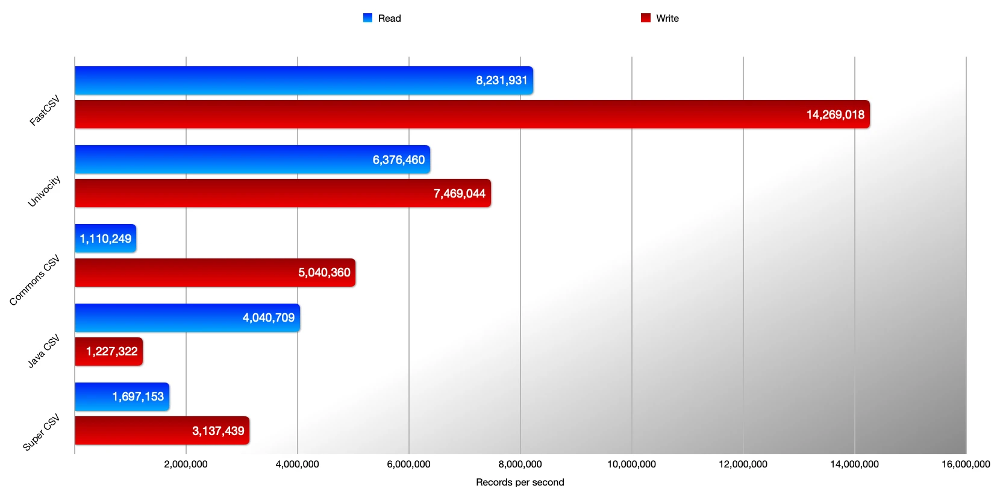

<p align="center">
  
</p>

<p align="center">
  FastCSV is a lightning-fast, dependency-free CSV library for Java that conforms to RFC standards.
</p>

<p align="center">
  <a href="https://github.com/osiegmar/FastCSV/actions/workflows/build.yml"></a>
  <a href="https://app.codacy.com/gh/osiegmar/FastCSV/dashboard?utm_source=gh&utm_medium=referral&utm_content=&utm_campaign=Badge_grade"></a>
  <a href="https://codecov.io/gh/osiegmar/FastCSV"></a>
  <a href="https://javadoc.io/doc/de.siegmar/fastcsv"></a>
  <a href="https://central.sonatype.com/artifact/de.siegmar/fastcsv"></a>
</p>

------

The primary use cases of FastCSV include:

- In *big data* applications: efficiently reading and writing data on a massive scale.
- In *small data* applications: serving as a lightweight library without additional dependencies.

## Benchmark & Compatibility

A selected benchmark from the
[Java CSV library benchmark suite](https://github.com/osiegmar/JavaCsvBenchmarkSuite) project:



While maintaining high performance, FastCSV serves as a strict RFC 4180 CSV writer while
also exhibiting the ability to read somewhat garbled CSV data.
See [JavaCsvComparison](https://github.com/osiegmar/JavaCsvComparison) for details.

## Features

As one of the most popular CSV libraries for Java on GitHub, FastCSV comes with a wide range of features:

- Crafted with natural intelligence, :heart:, and AI assistance :sparkles:
- Enables ultra-fast reading and writing of CSV data
- Has zero runtime dependencies
- Maintains a small footprint
- Provides a null-free and developer-friendly API
- Compatible with GraalVM Native Image
- Delivered as an OSGi-compliant bundle
- Actively developed and maintained
- Well-tested and documented

### CSV specific

- Compliant to [RFC 4180](https://tools.ietf.org/html/rfc4180) – including:
    - Newline and field separator characters in fields
    - Quote escaping
- Configurable field separator
- Supports line endings `CRLF` (Windows), `LF` (Unix) and `CR` (old macOS)
- Supports unicode characters

### Reader specific

- Supports reading of some non-compliant (real-world) data
- Preserves line break character(s) within fields
- Preserves the starting line number (even with skipped and multi-line records) – helpful for error messages
- Auto-detection of line delimiters (`CRLF`, `LF`, or `CR` – can also be mixed)
- Configurable data validation
- Supports (optional) header records (get field based on field name)
- Supports skipping empty lines
- Supports commented lines (skipping & reading) with configurable comment character
- Configurable field modifiers (e.g., to trim fields)
- Flexible callback handlers (e.g., to directly map to domain objects)
- BOM support (UTF-8, UTF-16 LE/BE, UTF-32 LE/BE)

### Writer specific

- Supports flexible quoting strategies (e.g., to differentiate between empty and null)
- Supports writing comments

## Requirements

- for 3.x version: Java ⩾ 11 (Android 13 / API level 33)
- for 2.x version: Java ⩾ 8 (Android 8 / API level 26)

> :bulb: Android is not Java and is not officially supported.
> Nevertheless, some basic checks are included in the continuous integration pipeline to
> verify that the library *should* work with Android.

## CsvReader examples

### Iterative reading of some CSV data from a string

```java
CsvReader.builder().ofCsvRecord("foo1,bar1\nfoo2,bar2")
    .forEach(System.out::println);
```

### Iterative reading of a CSV file

```java
try (CsvReader<CsvRecord> csv = CsvReader.builder().ofCsvRecord(file)) {
    csv.forEach(System.out::println);
}
```

### Iterative reading of some CSV data with a header

```java
CsvReader.builder().ofNamedCsvRecord("header 1,header 2\nfield 1,field 2")
    .forEach(rec -> System.out.println(rec.getField("header2")));
```

### Iterative reading of some CSV data with a custom header

```java
CsvCallbackHandler<NamedCsvRecord> callbackHandler =
    new NamedCsvRecordHandler("header1", "header2");

CsvReader.builder().build(callbackHandler, "field 1,field 2")
    .forEach(rec -> System.out.println(rec.getField("header2")));
```

### Custom settings

```java
CsvReader.builder()
    .fieldSeparator(';')
    .quoteCharacter('"')
    .commentStrategy(CommentStrategy.SKIP)
    .commentCharacter('#')
    .skipEmptyLines(true)
    .ignoreDifferentFieldCount(false)
    .acceptCharsAfterQuotes(false)
    .detectBomHeader(false);
```

## IndexedCsvReader examples

### Indexed reading of a CSV file

```java
try (IndexedCsvReader<CsvRecord> csv = IndexedCsvReader.builder().ofCsvRecord(file)) {
    CsvIndex index = csv.getIndex();

    System.out.println("Items of last page:");
    int lastPage = index.getPageCount() - 1;
    List<CsvRecord> csvRecords = csv.readPage(lastPage);
    csvRecords.forEach(System.out::println);
}
```

## CsvWriter examples

### Iterative writing of some data to a writer

```java
var sw = new StringWriter();
CsvWriter.builder().build(sw)
    .writeRecord("header1", "header2")
    .writeRecord("value1", "value2");

System.out.println(sw);
```

### Iterative writing of a CSV file

```java
try (CsvWriter csv = CsvWriter.builder().build(file)) {
    csv
        .writeRecord("header1", "header2")
        .writeRecord("value1", "value2");
}
```

### Custom settings

```java
CsvWriter.builder()
    .fieldSeparator(',')
    .quoteCharacter('"')
    .quoteStrategy(QuoteStrategies.ALWAYS)
    .commentCharacter('#')
    .lineDelimiter(LineDelimiter.LF);
```

## Further reading

- [Examples](example/src/main/java/example)
- [JavaDoc](https://javadoc.io/doc/de.siegmar/fastcsv)
- [How to upgrade](UPGRADING.md)
- [Changelog](CHANGELOG.md)
- [Design & Architecture](doc/architecture.md)
- [CSV Interpretation](doc/interpretation.md)
- [Design Goals](doc/goals.md)

---

## Sponsoring and partnerships


YourKit was used to optimize the performance and footprint of FastCSV.
YourKit is the creator of <a href="https://www.yourkit.com/java/profiler/">YourKit Java Profiler</a>,
<a href="https://www.yourkit.com/.net/profiler/">YourKit .NET Profiler</a>,
and <a href="https://www.yourkit.com/youmonitor/">YourKit YouMonitor</a>.
